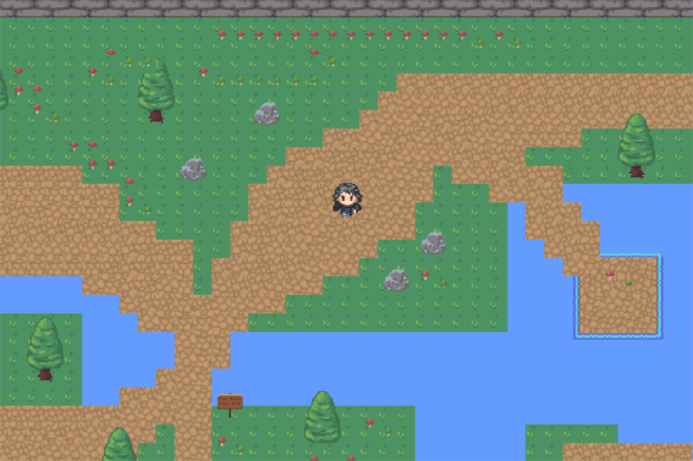

# Desert-insland-adventure

### ✍️ - Contents
- [About](#about)
- [Installation](#installation)
- [Todo](#todo)
- [Credits](#credits)
- [Thanks](#thanks)

## 🥶 About 
Hi I present my Desert-island-adventure game still in development phase (v1.0.0) .It will be a small rpg :) leave a star for support

## 🧰 Installation 
You must have the following dependencies :
- `pygame`
- `pytmx`
- `pyscroll`

To install them perform in the console : `pip install -r ./requirements.txt` (You can get code in release)

## 🔜 Todo 
- SoundManager
- Item
- Change of world
And more...
  
## 📌 Credits 
The creator is `Kyrokx( " ゴールド開発者 " )#7573` (On discord)

The licence is [MIT](LICENCE)

Server discord [Link](https://discord.gg/qYbPgM4GgF)

## 💌 Thanks 

_**Thank you for being interested in my project. Leave me a star to support me THANKS INFINITELY**_